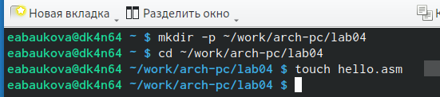
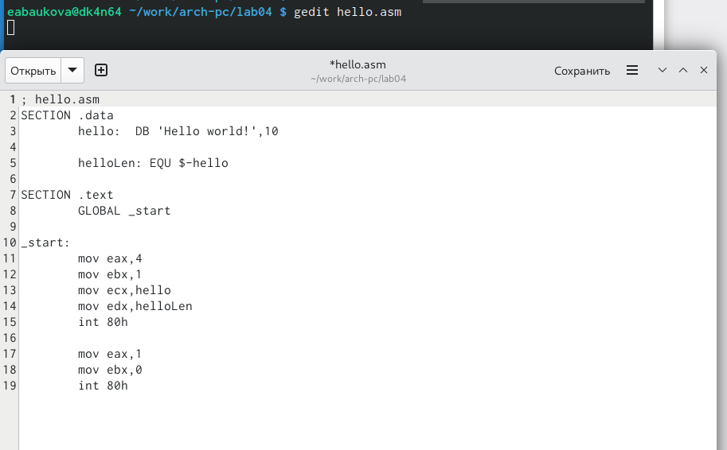
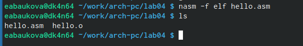
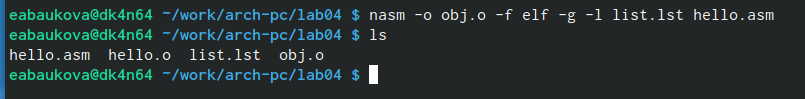
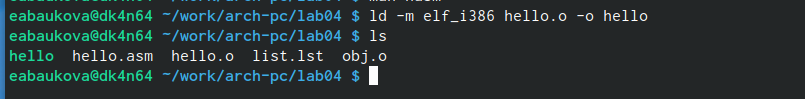
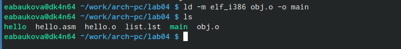
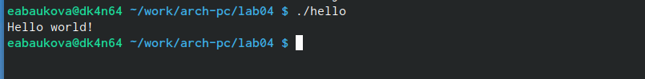
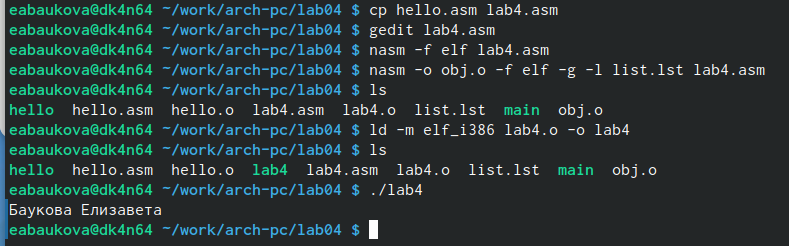
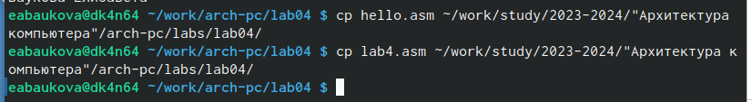
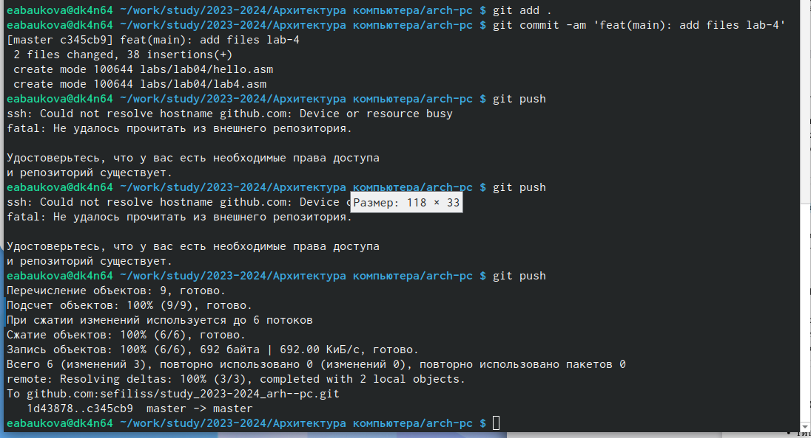

---
## Front matter
title: "Отчет по лабораторной работе №4"
subtitle: "Дисциплина: Архитектура компьютера"
author: "Баукова Елизавета Александровна"

## Bibliography
bibliography: bib/cite.bib
csl: pandoc/csl/gost-r-7-0-5-2008-numeric.csl

## Pdf output format
toc: true # Table of contents
toc-depth: 2
lof: true # List of figures
lot: true # List of tables
fontsize: 12pt
linestretch: 1.5
papersize: a4
documentclass: scrreprt
## I18n polyglossia
polyglossia-lang:
  name: russian
  options:
	- spelling=modern
	- babelshorthands=true
polyglossia-otherlangs:
  name: english
## I18n babel
babel-lang: russian
babel-otherlangs: english
## Fonts
mainfont: PT Serif
romanfont: PT Serif
sansfont: PT Sans
monofont: PT Mono
mainfontoptions: Ligatures=TeX
romanfontoptions: Ligatures=TeX
sansfontoptions: Ligatures=TeX,Scale=MatchLowercase
monofontoptions: Scale=MatchLowercase,Scale=0.9
## Biblatex
biblatex: true
biblio-style: "gost-numeric"
biblatexoptions:
  - parentracker=true
  - backend=biber
  - hyperref=auto
  - language=auto
  - autolang=other*
  - citestyle=gost-numeric
## Pandoc-crossref LaTeX customization
figureTitle: "Рис."
tableTitle: "Таблица"
listingTitle: "Листинг"
lofTitle: "Список иллюстраций"
lotTitle: "Список таблиц"
lolTitle: "Листинги"
## Misc options
indent: true
header-includes:
  - \usepackage{indentfirst}
  - \usepackage{float} # keep figures where there are in the text
  - \floatplacement{figure}{H} # keep figures where there are in the text
---

# Цель работы

Освоение процедуры компиляции и сборки программ, написанных на ассемблере NASM

# Выполнение лабораторной работы

Создали каталог для работы с программами на языке ассемблера NASM, перешли в созданный каталог и создали текстовый файл hello.asm. (рис. @fig:001).

{#fig:001 width=70%}

Открыли файл hello.asm с помощью gedit и ввели текст программы. (рис. @fig:002)

{#fig:002 width=70%}

Скомпилировали текст программы, создали объектный файл с именем hello.o и с помощью команды ls проверили, что объектный файл был создан. (рис. @fig:003)

{#fig:003 width=70%}

Создали объектный файл с именем obj.o и файл листинга list.lst, с помощью команды ls проверили, что файлы были созданы.(рис. @fig:004)

{#fig:004 width=70%}

Передали на обработку компоновщику ld объектный файл hello.o и создали исполняемый файл hello.(рис. @fig:005)

{#fig:005 width=70%}

Передали на обработку компоновщику ld объектный файл obj.o и создали исполняемый файл main.(рис. @fig:006)

{#fig:006 width=70%}

Запустили исполняемый файл hello.(рис. @fig:007)

{#fig:007 width=70%}

С помощью команды cp создали копию файла hello.asm с именем lab4.asm, с помощью текстового редактора gedit внесли изменения в текст программы в файле lab4.asm так, чтобы вместо Hello world! на экран выводилась строка с фамилией и именем, создали объектный файл lab4.o и obj.o, создали исполняемый файл lab4 и запустили исполняемый файл lab4.(рис. @fig:008)

{#fig:008 width=70%}

Скопировали файлы hello.asm и lab4.asm в локальный репозиторий.(рис.@fig:009)

{#fig:009 width=70%}

Загрузили файлы на Github.(рис.@fig:010)

{#fig:010 width=70%}

# Выводы

Освоили процедуру компиляции и сборки программ, написанных на ассемблере NASM.

