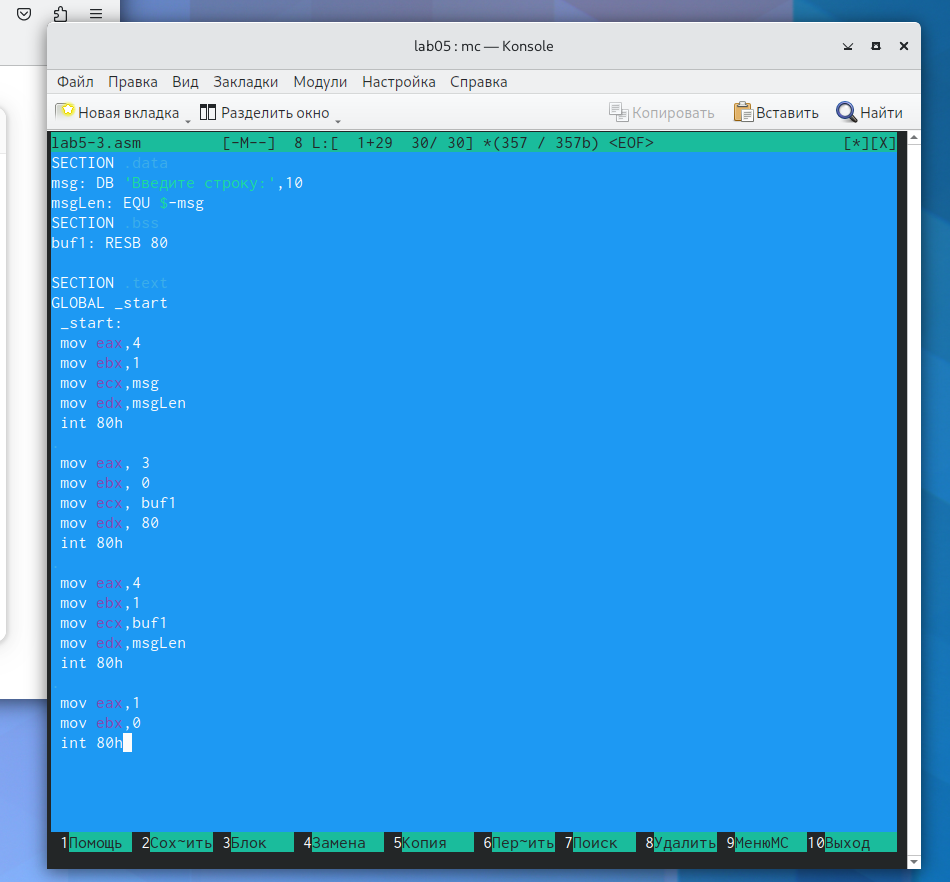

---
## Front matter
title: "Отчет по лабораторной работе №5"
subtitle: "Дисциплина: Архитектура компьютера"
author: "Баукова Елизавета"

## Generic otions
lang: ru-RU
toc-title: "Содержание"

## Bibliography
bibliography: bib/cite.bib
csl: pandoc/csl/gost-r-7-0-5-2008-numeric.csl

## Pdf output format
toc: true # Table of contents
toc-depth: 2
lof: true # List of figures
lot: true # List of tables
fontsize: 12pt
linestretch: 1.5
papersize: a4
documentclass: scrreprt
## I18n polyglossia
polyglossia-lang:
  name: russian
  options:
	- spelling=modern
	- babelshorthands=true
polyglossia-otherlangs:
  name: english
## I18n babel
babel-lang: russian
babel-otherlangs: english
## Fonts
mainfont: PT Serif
romanfont: PT Serif
sansfont: PT Sans
monofont: PT Mono
mainfontoptions: Ligatures=TeX
romanfontoptions: Ligatures=TeX
sansfontoptions: Ligatures=TeX,Scale=MatchLowercase
monofontoptions: Scale=MatchLowercase,Scale=0.9
## Biblatex
biblatex: true
biblio-style: "gost-numeric"
biblatexoptions:
  - parentracker=true
  - backend=biber
  - hyperref=auto
  - language=auto
  - autolang=other*
  - citestyle=gost-numeric
## Pandoc-crossref LaTeX customization
figureTitle: "Рис."
tableTitle: "Таблица"
listingTitle: "Листинг"
lofTitle: "Список иллюстраций"
lotTitle: "Список таблиц"
lolTitle: "Листинги"
## Misc options
indent: true
header-includes:
  - \usepackage{indentfirst}
  - \usepackage{float} # keep figures where there are in the text
  - \floatplacement{figure}{H} # keep figures where there are in the text
---

# Цель работы

Приобретение практических навыков работы в Midnight Commander. Освоение инструкций
языка ассемблера mov и int.

# Выполнение лабораторной работы

Открыли Midnight Commander с помощью команды mc и перешли в каталог ~/work/arch-pc. (рис.@fig:001)

{#fig:001 width=70%}

С помощью функциональной клавиши F7 создали папку lab05 и перешли  созданный каталог. (рис. @fig:002)

{#fig:002 width=70%}

С помощью команды touch создали файл lab5-1.asm. (рис. @fig:003)

{#fig:003 width=70%}

С помощью клавиши F4 открыли файл lab5-1.asm для редактирования и ввели текст программы.(рис. @fig:004)

{#fig:004 width=70%}

С помощью клавиши F2 сохранили изменения в файле, закрыли файл с помощью клавиши F10. С помощью клвиши F3 открыли файл lab5-1.asm для просмотра и убедились, что файл содержит текст программы.(рис. @fig:005)

{#fig:005 width=70%}

Создали объектный файл lab5-1.o, выполнили компоновку объектного файла и запустили исполняемый файл. На запрос программы ввели ФИО.(рис. @fig:006)

{#fig:006 width=70%}

Скачали файл in_out.asm, скопировали файл в каталог с файлом lab5-1.asm с помощью клавиши F5.(рис. @fig:007)

{#fig:007 width=70%}

C помощью клавиши F5 создали копию файла lab5-1.asm с именем lab5-2.asm.(рис. @fig:008)

{#fig:008 width=70%}

Исправили текст программы в файле lab5-2.asm с использованием подпрограмм sprintLF, sread, quit из внешнего файла in_out.asm.(рис. @fig:009)

{#fig:009 width=70%}

Создали исполняемый файл lab5-2.o, выполнили компоновку и запустили программу.(рис. @fig:010)

{#fig:010 width=70}

В файле lab5-2.asm заменили подпрограмму sprintLF на sprint, создали исполняемый файл и проверили его работу. С использованием подпрграммы sprint вводимый текст находится на одной строчке с приглашением "Введите строку".(рис. @fig:012)

{#fig:012 widyh=70%}

# Самостоятельная работа 

С помощью F5 cоздали копию файла lab5-1.asm с именем lab5-3.asm и внесли изменения в программу.(рис. @fig:013)

{#fig:013 width=70%}

Создали исполняемый файл и проверили его работу. (рис. @fig:014)

{#fig:014 width=70%}

Создали копию файла lab5-2.asm с именем lab5-4.asm и внесли изменения в программу, используя подпрограммы из внешнего файла in_out.asm.(рис. @fig:015)

{#fig:015 width=70%}

Создали исполняемый файл и проверили его работу.(рис. @fig:016)

{#fig:016 width=70%}

# Выводы

Приобрели практические навыки работы с Midnight Commander, освоили инструкции языка ассемблера mov и int, написали программы для ввода и вывода текста на экран.

