---
## Front matter
title: "Отчет по лабораторной работе №6"
subtitle: "Дисциплина: Архитектура компьютера"
author: "Баукова Елизавета Александровна"

## Generic otions
lang: ru-RU
toc-title: "Содержание"

## Bibliography
bibliography: bib/cite.bib
csl: pandoc/csl/gost-r-7-0-5-2008-numeric.csl

## Pdf output format
toc: true # Table of contents
toc-depth: 2
lof: true # List of figures
lot: true # List of tables
fontsize: 12pt
linestretch: 1.5
papersize: a4
documentclass: scrreprt
## I18n polyglossia
polyglossia-lang:
  name: russian
  options:
	- spelling=modern
	- babelshorthands=true
polyglossia-otherlangs:
  name: english
## I18n babel
babel-lang: russian
babel-otherlangs: english
## Fonts
mainfont: PT Serif
romanfont: PT Serif
sansfont: PT Sans
monofont: PT Mono
mainfontoptions: Ligatures=TeX
romanfontoptions: Ligatures=TeX
sansfontoptions: Ligatures=TeX,Scale=MatchLowercase
monofontoptions: Scale=MatchLowercase,Scale=0.9
## Biblatex
biblatex: true
biblio-style: "gost-numeric"
biblatexoptions:
  - parentracker=true
  - backend=biber
  - hyperref=auto
  - language=auto
  - autolang=other*
  - citestyle=gost-numeric
## Pandoc-crossref LaTeX customization
figureTitle: "Рис."
tableTitle: "Таблица"
listingTitle: "Листинг"
lofTitle: "Список иллюстраций"
lotTitle: "Список таблиц"
lolTitle: "Листинги"
## Misc options
indent: true
header-includes:
  - \usepackage{indentfirst}
  - \usepackage{float} # keep figures where there are in the text
  - \floatplacement{figure}{H} # keep figures where there are in the text
---

# Цель работы

Освоение арифметических инструкций языка ассемблера NASM.

# Выполнение лабораторной работы

Создали каталог для программ лабораторной №6, перешли в него и создали файл lab6-1.asm.(рис. @fig:001)

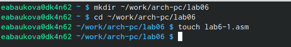{#fig:001 width=70%}

Ввели в файл lab6-1.asm текст программы из листинга 6.1.(рис. @fig:002)

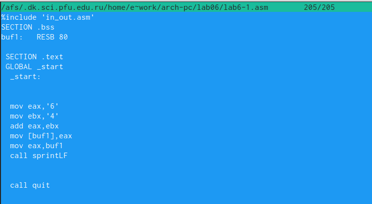{#fig:002 width=70%}

Cоздали исполняемый файл и запустили его.(рис. @fig:003)

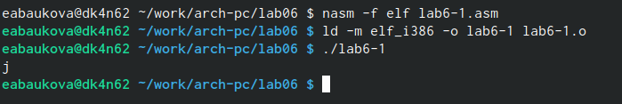{#fig:003 width=70%}

Изменили текст программы в файле lab6-1.asm и записали числа вместо символов в регистры. (рис. @fig:004)

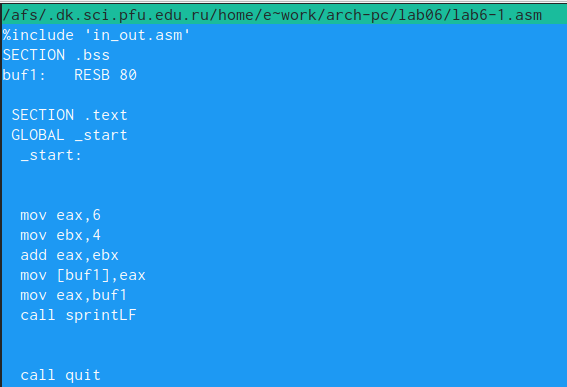{#fig:004 width=70%}

Создали исполняемый файл и запустили его.(рис. @fig:005)

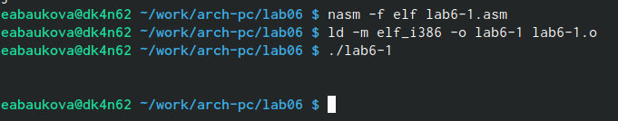{#fig:005 width=70%}

Код 10 соответствует символу  \ n, он не выводится на экран.

Создали файл lab6-2.asm.(рис. @fig:006)

{#fig:006 width=70%}

Ввели в файл lab6-2.asm текст программы из листинга 6.2.(рис. @fig:007)

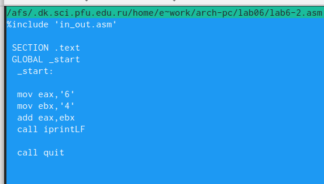{#fig:007 width=70%}

Создали исполняемый файл и запустили его.(рис. @fig:008)

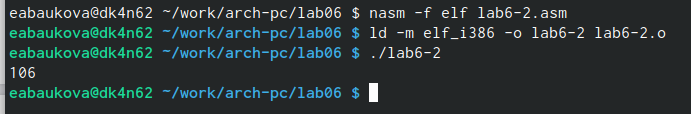{#fig:008 width=70%}

Заменили символы на числа в файле lab6-2.asm, создали исполняемый файл и запустили его.(рис. @fig:010)

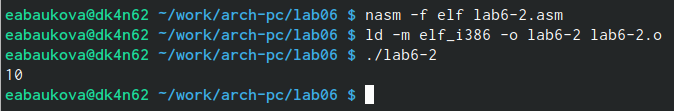{#fig:010 width=70%}

Заменили функцию iprintLF на iprint, создали исполняемый файл и запустили его.(рис.@fig:011)

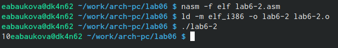{#fig:011 width=70%}

В отличие от iprintLF, iprint выводит результат на одной строке с командной строкой.

Создали файл lab6-3.asm и ввели программу из листинга 6.3.(рис. @fig:013)

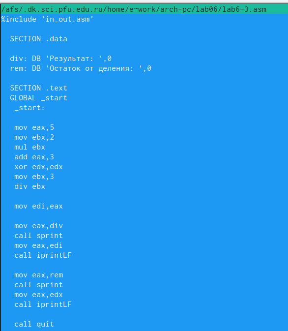{#fig:013 width=70%}

Создали исполняемый файфл и запустили его.Результат работы программы совпадает с предложенным в текстен лабораторной работы. (рис. @fig:014)

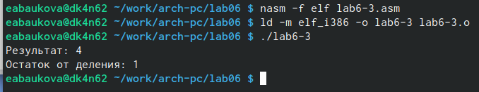{#fig:014 width=70%}

Изменили текст программы для вычисления выражения 𝑓(𝑥) = (4 ∗ 6 + 2)/5.(рис. @fig:015)

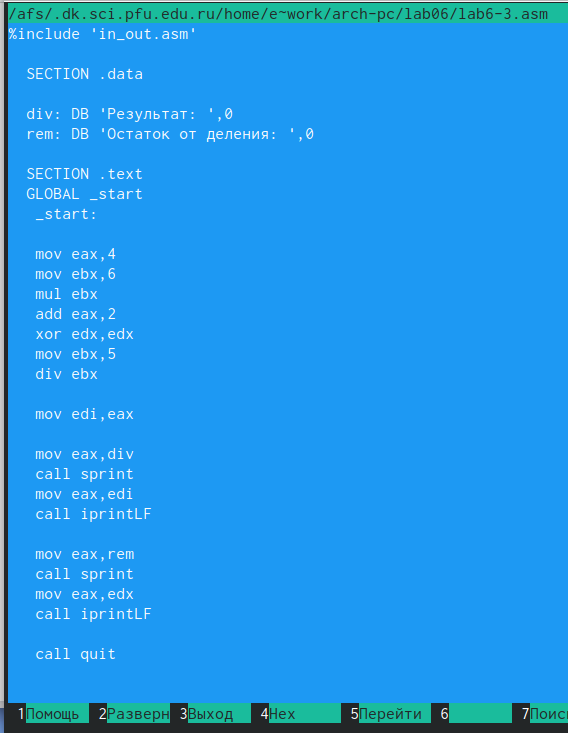{#fig:015 width=70%}

Создали исполняемый файл и запустили его.Программа работает корректно.(рис. @fig:016)

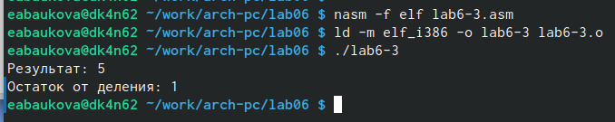{#fig:016 width=70%}

Создали файл variant.asm и ввели в него программу из листинга 6.4.(рис. @fig:018)

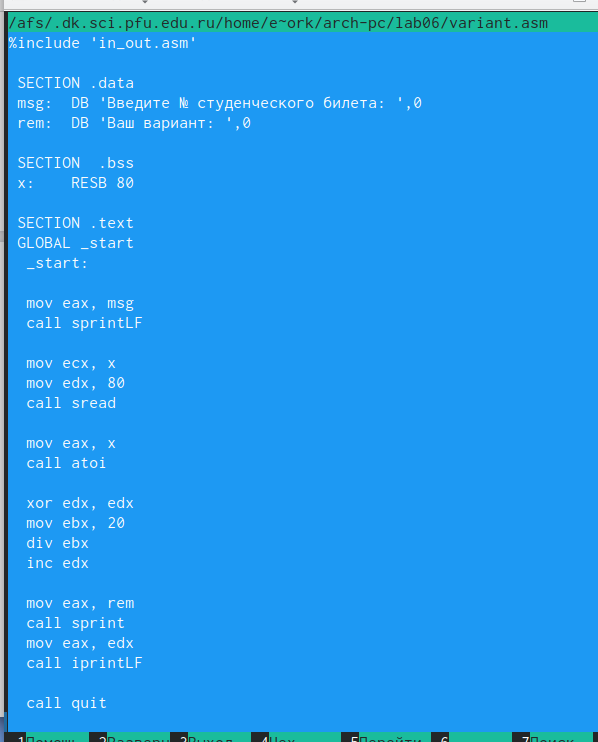{#fig:018 width=70%}

Создали исполняемый файл и запустили его.Программа работает корректно.(рис. @fig:019)

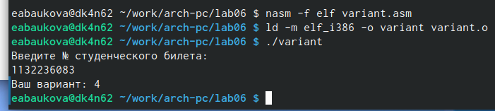{#fig:019 width=70%}

1. mov eax, rem; call sprint
2. Для ввода и записи значения в переменную x
3. Для преобразования кода символа в целое число 
4. mov ebx,20;div ebx;inc edx
5. В edx
6. Она увеличивает значение регистра edx на 1
7. mov eax,rem;call sprint;mov eax,edx;call iprintLF

#Самостоятельная работа

Создали файл samrab.asm и написали программу для вычисления выражения.(рис. @fig:020)

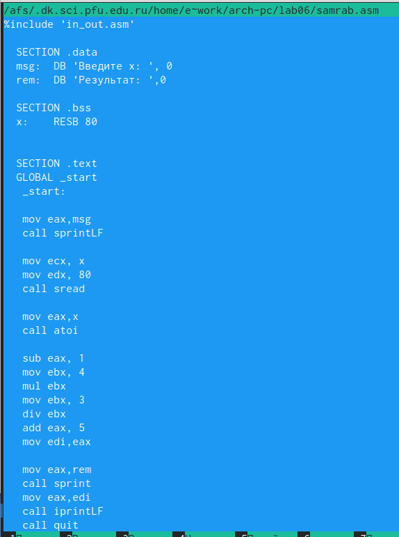{#fig:020 width=70%}

Создали исполняемый файл и проверили его работу для значений 𝑥1 и 𝑥2.(рис. @fig:021)

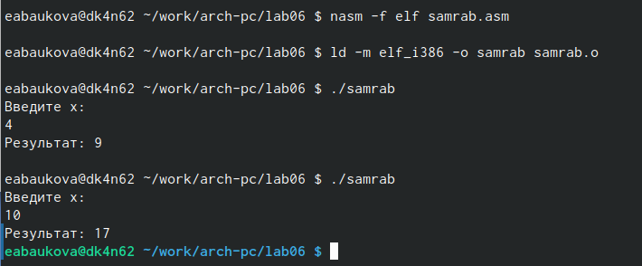{#fig:021 width=70%}

# Выводы

Освоили арифметические инструкции языка ассемблера NASM и написали программу для вычисления значения выражения.

# Список литературы{.unnumbered}

::: {#refs}
:::
